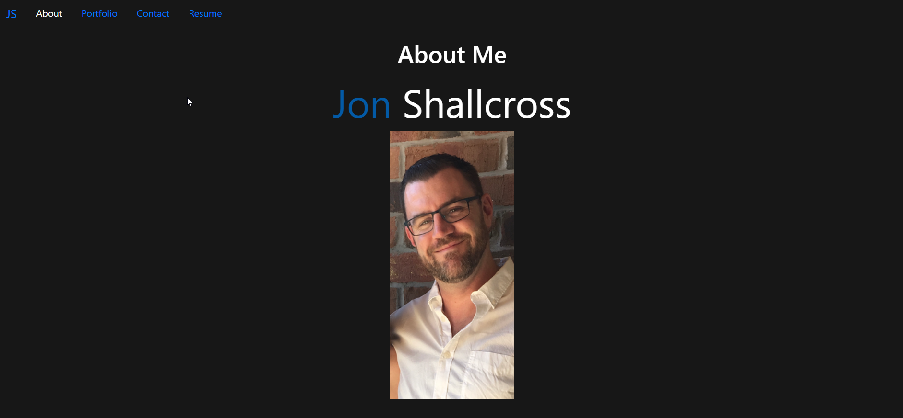

# React Portfolio

Welcome to my React Portfolio website. This was week-20 challenge from the U of T Coding Boot Camp.

## Authors

- [@jshallcross](https://www.github.com/jshallcross)

  
## Demo

Live Site: https://jshallcross.github.io/react-portfolio/

  
## License

[MIT](https://choosealicense.com/licenses/mit/)

  
  
## Screenshots

## Features

- Contact Form send an email to my personal inbox
- Resume is viewable on iPads or larger
- Resume is downloadable

  
## Tech Stack

React / Bootstrap

FormSubmit for easy setup of a working form

  
## Feedback

If you have any feedback, please reach out to me at jshallcross1@icloud.com
